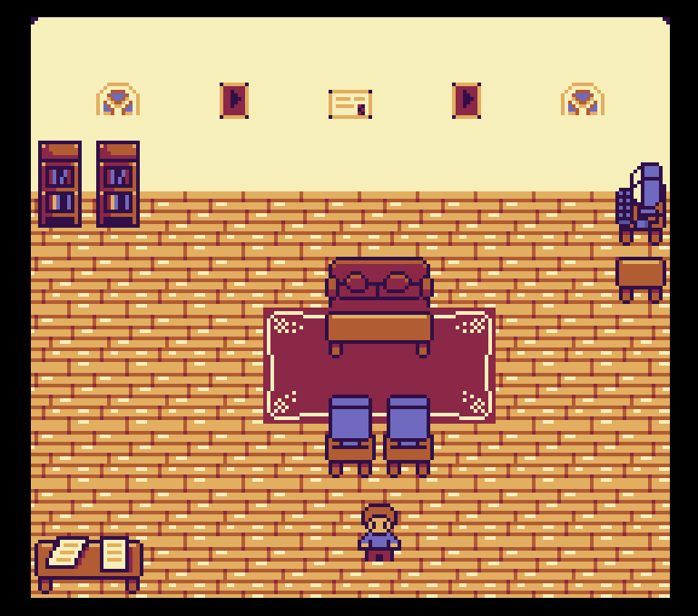

# 🕹 2D Portfolio

Explore an interactive 2D portfolio where you can freely move around and interact with different elements.
> 🖥️📱 This project is compatible with both desktop and mobile/touch devices.

---

## 🎯 Description

This portfolio was built **from scratch** as part of my personal learning journey in software development.  
It helped me reinforce my knowledge of:

- HTML
- CSS
- JavaScript
- Canvas API
- Object-Oriented Programming (OOP)
  
---

## 📋 How to Use

1. **Desktop:** Use the keyboard arrow keys or the on-screen touch controls to navigate.
2. **Mobile/Touch Devices:** Use the on-screen touch controls to move around.
3. Interactive elements include dialogue boxes with links to external sites.

Enjoy exploring!

---

## 🛠️ Technologies Used

- HTML5 + Canvas
- CSS3
- JavaScript (Vanilla)
- Object-Oriented Design

---

## ⚠️ Requirements

- Fully responsive: works perfectly on **desktop and mobile devices**
- Best experienced on **Chrome** or **Firefox**

---

## 👨‍💻 Author

Developed by **Jose Angel Gil**  
GitHub: [@joseangelgil](https://github.com/joseangelgil)

---

## 📷 Screenshot

